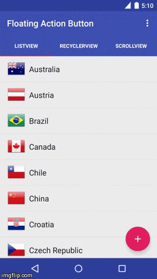

FloatingActionButton
====================

[](http://android-arsenal.com/details/1/824)

### Description

Android [floating action button] which reacts on scrolling events. Becomes visible when an attached target is scrolled up and invisible when scrolled down.



### Demo

[](https://play.google.com/store/apps/details?id=com.melnykov.fab.sample)

### Integration

**1)** Add as a dependency to your ``build.gradle``:

```groovy
dependencies {
    compile 'com.melnykov:floatingactionbutton:1.3.0'
}
```

**2)** Add the ``com.melnykov.fab.FloatingActionButton`` to your layout XML file. The button should be placed in the bottom right corner of the screen. The width and height of the floating action button are hardcoded to **56dp** for the normal and **40dp** for the mini button as specified in the [guidelines].

```xml
<FrameLayout xmlns:android="http://schemas.android.com/apk/res/android"
             xmlns:fab="http://schemas.android.com/apk/res-auto"
             android:layout_width="match_parent"
             android:layout_height="match_parent">

    <ListView
            android:id="@android:id/list"
            android:layout_width="match_parent"
            android:layout_height="match_parent" />

    <com.melnykov.fab.FloatingActionButton
            android:id="@+id/fab"
            android:layout_width="wrap_content"
            android:layout_height="wrap_content"
            android:layout_gravity="bottom|right"
            android:layout_margin="16dp"
            android:src="@drawable/ic_action_content_new"
            fab:fab_colorNormal="@color/primary"
            fab:fab_colorPressed="@color/primary_pressed"
            fab:fab_colorRipple="@color/ripple" />
</FrameLayout>
```

**3)** Attach the FAB to ``AbsListView``, ``RecyclerView`` or ``ScrollView`` :

```java
ListView listView = (ListView) findViewById(android.R.id.list);
FloatingActionButton fab = (FloatingActionButton) findViewById(R.id.fab);
fab.attachToListView(listView);
```

Check the sample project to see how to use custom listeners if you need to track scroll events.

**4)** Add the namespace ``xmlns:fab="http://schemas.android.com/apk/res-auto"`` to your layout file.

+ Set the button type (normal or mini) via the ``fab_type`` xml attribute (default is normal):

    ```xml
    fab:fab_type="mini"
    ```
    or
    ```java
    fab.setType(FloatingActionButton.TYPE_MINI);
    ```
+ Set the normal and pressed colors via the xml attributes:

    ```xml
    fab:fab_colorNormal="@color/primary"
    fab:fab_colorPressed="@color/primary_pressed"
    ```
    or
    ```java
    fab.setColorNormal(getResources().getColor(R.color.primary));
    fab.setColorPressed(getResources().getColor(R.color.primary_pressed));
    ```
    
+ Enable/disable the button shadow with the ``fab_shadow`` xml attribite (it's enabled by default):

    ```xml
    fab:fab_shadow="false"
    ```
    or
    ```java
    fab.setShadow(false);
    ```
    
+ Show/hide the button expliciltly:
    
    ```java
    fab.show();
    fab.hide();
    
    fab.show(false); // Show without an animation
    fab.hide(false); // Hide without an animation
    ```
    
+ Specify the ripple color for API 21+:

    ```xml
    fab:fab_colorRipple="@color/ripple"
    ```

    or
   ```java
   fab.setColorRipple(getResources().getColor(R.color.ripple));
   ```

**5)** Set an icon for the ``FloatingActionButton`` using ``android:src`` xml attribute. Use drawables of size **24dp** as specified by [guidelines]. Icons of desired size can be generated with [Android Asset Studio].

### Changelog

**Version 1.3.0**
+ Add the disabled state for the FAB (thanks to [Aleksey Malevaniy](https://github.com/almozavr));
+ Fix shadow assets. Rename shadow drawables with a prefix;
+ Generate default pressed and ripple colors (thanks to [Aidan Follestad](https://github.com/afollestad)).

**Version 1.2.0**
+ Respect an elevation set manually for the FAB;
+ Don't emit a scroll when the listview is empty;
+ Add an ability to attach normal listeners for scroll operations (thanks to [Bill Donahue](https://github.com/bdonahue)).

**Version 1.1.0:**
+ Do not ignore negative margins on pre-Lollipop;
+ Disable clicks on the FAB when it's hidden on pre-Honeycomb;
+ Some shadow tuning.

**Version 1.0.9:**
+ Support API 7;
+ Fixed extra margins on pre-Lollipop devices;
+ Fixed mini FAB size;
+ Updated shadow assets to more accurately match 8dp elevation.

**Version 1.0.8:**
+ ATTENTION! Breaking changes for custom listeners. Check an updated sample how to use them.
+ Added support for the ``ScrollView``;
+ Significantly optimized scroll detection for the ``RecyclerView``;
+ Fixed laggy animation for a list view with items of different height;
+ Added ``isVisible`` getter;
+ Deleted deprecated methods.

**Version 1.0.7:**
+ Updated shadow assets to better match material design guidelines;
+ Make ``FabOnScrollListener`` and ``FabRecyclerOnViewScrollListener`` implement ``ScrollDirectionListener`` for easier custom listeners usage.

**Version 1.0.6:**
+ Added support for the ``RecyclerView``;
+ Added ripple effect and elevation for API level 21.

Thanks to [Aidan Follestad](https://github.com/afollestad).

**Version 1.0.5:**
+ Updated shadow to more accurately match the material design spec;

**Version 1.0.4:**

+ Allow a custom ``OnScrollListeners`` to be attached to a list view;
+ Work properly with list of different height rows;
+ Ignore tiny shakes of fingers.

**Version 1.0.3:**
+ Add methods to show/hide without animation;
+ Fix show/hide when a view is not measured yet.


### Applications using FloatingActionButton

Please [ping](mailto:makovkastar@gmail.com) me or send a pull request if you would like to be added here.

Icon | Application | Icon | Application
------------ | ------------- | ------------- | -------------
 | [Finger Gesture Launcher] |  | [Vocabletrainer] 
 | [Lanekeep GPS Mileage Tracker] |  | [Score It]
 | [Перезвони мне] |  | [App Swap] 
 | [QKSMS - Quick Text Messenger] |  | [Uninstaller - Beta Version] 
 | [Device Control] |  | [Confide]
 | [Date Night] |  | [Jair Player The Music Rainbow] 
 | [Taskr - Lista de Tareas] |  | [Festivos: ¡Conoce el mundo!] 
 | [nowPaper] |  | [Vicious chain - Don't do that!]
 | [My Football Stats] |  | [The ScoreBoard]
 | [NavPoint] |  | [Just Reminder] 
 | [Early Notes] |  | [Ranch - Smart Tip Calculator]
 | [Thiengo Calopsita] |  | [Tinycore - CPU, RAM monitor] |
 | [Battery Aid Saver & Manager]

### Links

Country flag icons used in the sample are taken from www.icondrawer.com

### License

```
The MIT License (MIT)

Copyright (c) 2014 Oleksandr Melnykov

Permission is hereby granted, free of charge, to any person obtaining a copy
of this software and associated documentation files (the "Software"), to deal
in the Software without restriction, including without limitation the rights
to use, copy, modify, merge, publish, distribute, sublicense, and/or sell
copies of the Software, and to permit persons to whom the Software is
furnished to do so, subject to the following conditions:

The above copyright notice and this permission notice shall be included in all
copies or substantial portions of the Software.

THE SOFTWARE IS PROVIDED "AS IS", WITHOUT WARRANTY OF ANY KIND, EXPRESS OR
IMPLIED, INCLUDING BUT NOT LIMITED TO THE WARRANTIES OF MERCHANTABILITY,
FITNESS FOR A PARTICULAR PURPOSE AND NONINFRINGEMENT. IN NO EVENT SHALL THE
AUTHORS OR COPYRIGHT HOLDERS BE LIABLE FOR ANY CLAIM, DAMAGES OR OTHER
LIABILITY, WHETHER IN AN ACTION OF CONTRACT, TORT OR OTHERWISE, ARISING FROM,
OUT OF OR IN CONNECTION WITH THE SOFTWARE OR THE USE OR OTHER DEALINGS IN THE
SOFTWARE.
```

[floating action button]:http://www.google.com/design/spec/components/buttons.html#buttons-floating-action-button
[guidelines]:http://www.google.com/design/spec/patterns/promoted-actions.html#promoted-actions-floating-action-button
[Android Asset Studio]:http://romannurik.github.io/AndroidAssetStudio/icons-generic.html
[Finger Gesture Launcher]:https://play.google.com/store/apps/details?id=com.carlosdelachica.finger
[Vocabletrainer]:https://play.google.com/store/apps/details?id=com.rubengees.vocables
[Lanekeep GPS Mileage Tracker]:https://play.google.com/store/apps/details?id=me.hanx.android.dashio&hl=en
[Score It]:https://play.google.com/store/apps/details?id=com.sbgapps.scoreit
[Перезвони мне]:https://play.google.com/store/apps/details?id=com.melnykov.callmeback
[App Swap]:https://play.google.com/store/apps/details?id=net.ebt.appswitch
[QKSMS - Quick Text Messenger]:https://play.google.com/store/apps/details?id=com.moez.QKSMS
[Uninstaller - Beta Version]:https://play.google.com/store/apps/details?id=com.kimcy92.uninstaller
[Device Control]:https://play.google.com/store/apps/details?id=org.namelessrom.devicecontrol
[Confide]:https://play.google.com/store/apps/details?id=cm.confide.android
[Date Night]:https://play.google.com/store/apps/details?id=com.sababado.datenight
[Jair Player The Music Rainbow]:https://play.google.com/store/apps/details?id=aj.jair.music
[Taskr - Lista de Tareas]:https://play.google.com/store/apps/details?id=es.udc.gestortareas
[Festivos: ¡Conoce el mundo!]:https://play.google.com/store/apps/details?id=com.logicapps.holidays
[nowPaper]:https://play.google.com/store/apps/details?id=com.dunrite.now
[Vicious chain - Don't do that!]:https://play.google.com/store/apps/details?id=com.magratheadesign.viciouschain
[My Football Stats]:https://play.google.com/store/apps/details?id=com.nicorz.futbol5
[The ScoreBoard]:https://play.google.com/store/apps/details?id=it.pagano.sp
[NavPoint]:https://play.google.com/store/apps/details?id=com.abi_khalil.remy.nav_point
[Just Reminder]:https://play.google.com/store/apps/details?id=com.cray.software.justreminder
[Early Notes]:https://play.google.com/store/apps/details?id=com.gmail.earlynotesapp.earlynotes
[Ranch - Smart Tip Calculator]:https://play.google.com/store/apps/details?id=com.andreifedianov.android.ranch
[Thiengo Calopsita]:https://play.google.com/store/apps/details?id=br.thiengocalopsita
[Tinycore - CPU, RAM monitor]:https://play.google.com/store/apps/details?id=org.neotech.app.tinycore
[Battery Aid Saver & Manager]:https://play.google.com/store/apps/details?id=com.battery.plusfree
